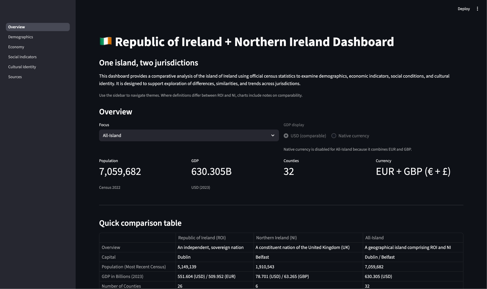

# 1. Introduction, Scope and Context

## 1.1 Introduction

In 1921, following the Irish War of Independence, the island of Ireland was split into two: the Republic of Ireland (ROI), which would later develop into a sovereign state, and Northern Ireland (NI), a constituent nation of the UK. In the one hundred years since, different administrations and governance styles have created structural and societal divergence. Naturally, this has led to different methods of collecting data. In the Republic (ROI), the CSO (Central Statistics Office) manages this whereas in the North (NI), NISRA (Northern Ireland Statistics and Research Agency) does. The two agencies have different definitions, methodologies and styles for data collection, and therefore the resulting statistical frameworks are different.

As a result, it is difficult to directly compare the two nations accurately. For example, they both classify data differently and have differing definitions for common metrics such as housing tenure at more detailed category levels. This partially stems from differences in housing policy frameworks and administrative responsibilities, causing tenure categories to be defined and reported differently. They also report said data differently, with censuses not always being conducted in the same reference year.

## 1.2 Purpose

This dashboard attempts to harmonise the data from both nations, in order to be able to accurately compare and draw relevant, insightful conclusions. The dashboard has been designed to seamlessly compare various metrics in the ROI and NI, and to provide all-island insights where it is logical to do so. This allows the user to interpret the indicators presented, to support informed conclusions. The dashboard has been designed for analysts and policymakers, to help understand the structural divide between the two nations, but is also suitable for the general public to inform themselves. A live dashboard was chosen over static charts or reports to encourage interactivity, enabling flexible exploration and comparison of indicators in an accessible manner. The user can explore multiple indicators to form a more general view of the differences, whilst still allowing them to analyse specific indicators. This dashboard does not aim to make predictions or claims about reunification scenarios, instead opting to support informed interpretation.

## 1.3 Scope

The dashboard covers multiple themes including demographics, economy, housing, education and health. These themes were selected as they are structurally significant, meaning that they are essential to get a picture of each nation, and to form comparisons. They are widely measured across both jurisdictions, making it more suitable for harmonisation. 

Geographically, the dashboard covers the Republic of Ireland (ROI), Northern Ireland (NI), and All-Island aggregates where appropriate. However, the All-Island views are only used when they can be logically and methodologically justified.

Data is presented at a national or regional level. No individual-level data is used. This helps to form aggregates at a societal level. More importantly, it means there are no invasions of privacy, ensuring the dashboard is ethically made.

The timeframe of the data is census-based, mostly in recent years, although some indicators have larger timeframes than others. There are some constraints here though, yearly figures are almost impossible to accurately obtain, with most being derived estimates. As a result, I have decided to stick to published census cycles. 

## 1.4 Exclusions

There were deliberate choices to exclude certain indicators. Predictive modelling has been excluded due to requiring strong causal assumptions and consistent time-series data which isn't readily available. Including this would extrapolate from historical data, and would degrade the evidential strength of the data. 

Real-time data has also been excluded as official cross-border statistics are often published at very low frequencies, so they are not available in real time, and they are often revised post-release. Including this would undermine reproducibility and prioritise current data over reliable data. I have also chosen to exclude local geographic data as it is overly specific and contradicts the high-level picture the dashboard aims to provide. 

Finally, I have purposely not redefined any source classifications, as doing this would require strong subjective assumptions, and may misrepresent source data. Furthermore, the official cross-border census data is already harmonised. By preserving the source definitions, it helps to maintain transparency.

These exclusions were applied deliberately as they were necessary to ensure valid comparison and interpretability. It keeps the data reliable, and helps to prevent scope creep.

## 1.5 Primary Data Sources

To ensure reliability, the dashboard draws exclusively from official statistical sources. The main sources are the Central Statistics Office (CSO) for ROI and the Northern Ireland Statistics and Research Agency (NISRA) for NI. These bodies are the authoritative national statistical agencies, and are responsible for the census and official socio-economic data.

Where possible, data is sourced from the joint CSO-NISRA cross-border publications, as they are specially designed for all-island comparison, and they represent the highest level of official harmonisation that is available. The core of the dashboard is formed by census data, as they provide near-full population coverage and use stable, well-documented methodologies.

However, it is important to note that census reference years are not fully aligned across jurisdictions. In particular, the Northern Ireland census was conducted in 2021, while the Republic of Ireland census took place in 2022. This delay arose due to the pandemic, and is an inherent limitation of cross-jurisdictional comparison. The differing reference years are documented and explicitly acknowledged in the dashboard. For consistency, the combined 2021/2022 census is referred to as 2022 within the dashboard.

A limited number of contextual indicators, such as single-year GDP figures, are derived from published data from the CSO and ONS (Office for National Statistics - UK). However, these are exclusively used for high-level context and do not form part of the core comparisons.
## 1.6 Harmonisation

Harmonisation is achieved through selecting relevant metrics, rather than redefining them. This means that original source classifications are preserved. The dashboard relies on officially harmonised data where available. No attempt is made to force equivalence beyond what the sources provide.

Nevertheless, some differences remain due to national statistical frameworks, collection methodologies, and publication schedules. These limitations are unavoidable, but are minimised and made explicit to the user. 

The chosen data sources maximise reliability and comparability while being transparent about any remaining constraints.

# 2 Methodology and Data Analysis

## 2.1 Data Preparation and Cleaning

### **Raw Data Formats and Data Ingestion**

All datasets used for the dashboard were obtained in a machine-readable format. Census tables were downloaded as CSV files, and map data was downloaded in JSON-based formats, including GeoJSON. All datasets were downloaded from official sources such as the CSO, NISRA, and joint publications. No manual transcription or scraping was used for core analytical variables. However, a small number of high-level contextual values were manually transcribed, such as the number of counties and a single-year GDP snapshot. These values are static and are not used in comparative analysis. These manual entries were also sourced from official publications and they do not affect calculated indicators.

All datasets used in the dashboard are documented in the 'Sources' page of the dashboard. This page contains a list of all data sources used. Each source contains a title, the publication it originated from, the date the dataset was accessed and downloaded, and a button to open the link.

### **Initial Validation and Schema Checking**

Even though all data came from official statistical bodies, it wasn't safe to assume that datasets were structurally consistent. Validation was performed immediately after ingestion but before cleaning. The aim was to ensure structural consistency and suitability for cross-jurisdictional analysis.

Each dataset was checked for the presence of expected columns, the absence of duplicate or unexpected fields, and consistent column naming across files. Datasets that did not meet these criteria were standardised or excluded before any more processing occurred.

Column data types were validated; numerical values (counts, percentages) were treated as floats, with categorical fields treated as strings. Basic value checks were applied to make sure category labels were valid and numerical values were within valid ranges. Any values that violated these rules were rare, and were identified and either filtered or excluded, rather than being automatically corrected.

Region identifiers (ROI, NI, All-Island) were explicitly checked and any inconsistent naming schemes were standardised. Joins and aggregations relied on explicit labels rather than implicit ordering.

Census reference years were checked for each dataset. Any datasets covering different census years were clearly labelled, and any incompatible years were kept separate. No values were adjusted or estimated. Adjacent census years (e.g. 2021/2022) are shown together on the dashboard only for visual consistency, not for analysis purposes.

Minor schema differences existed between datasets. These were mainly resolved through column renaming, and reordering fields. However, no categories were merged and no definitions were altered.

Only datasets that passed validation were included in order to ensure reproducibility, consistency and robust analysis.

### **2.2 Handling Missing and Incomplete Data**

The datasets used for the dashboard are primarily census based, meaning that there was not much missing data. Any incompleteness arises mostly from categories not being published uniformly across jurisdictions and certain indicators being unavailable across specific years or regions. To handle this, comparisons were exclusively restricted to published, overlapping data. On top of that, no estimation was used to fill in missing values. This ensured that the data shown prioritised validity over one hundred percent completeness. Missing data had minimal impact in the cleaning process, as the census already had near-complete coverage.

### **Label and Category Standardisation**

Most datasets used were already harmonised or standardised at their source. The joint CSO-NISRA publications already have aligned category structures. However, conceptual definitions may still differ across jurisdictions. The standardisation that was needed was only for minor formatting consistency. This includes column naming conventions and uniform region labels (ROI / NI / All-Island where used). There was no redefinition or restructuring of categories. No groups were merged, and every national definition was preserved. Any differences in definitions between jurisdictions were acknowledged but not changed.

### **Comparable Categories and Harmonisation Decisions**

Categories used in the dashboard were already aligned with the joint CSO-NISRA publications. Only indicators with a clear theoretical overlap, and similar measurement intent were compared. Categories with different legal definitions, policy frameworks or reporting methods were deliberately excluded. Niche subcategories that diverge across jurisdictions were also left out. 

To preserve the usefulness of the data, and to keep it factual and unbiased, similar sounding categories were not forcibly equated or merged, in order to eliminate any subjectivity. In addition, categories were not weighted or adjusted to compensate for any differences. Any attempts at artificial harmonisation risked misleading conclusions, so as a result, transparency is preferred over completeness.

### **Storage of Cleaned Data**

Each cleaning script outputs a cleaned dataset. All cleaned datasets are stored in a separate directory from the raw data. This allows the raw datasets to remain unchanged. The clear separation between raw and clean data allows for reproducibility, traceability, and protection of the original sources. Additionally, the cleaning scripts are deterministic: running the same script on the same raw data will always produce an identical output. 

Every dataset is stored in CSV format. It was chosen for portability, transparency and ease of inspection. It is also the format that the raw data originated in, so it is better for compatibility too.

The dashboard only reads from cleaned datasets. Raw data is never directly used for visualisations, enforcing a single and validated source of truth.

## 2.3 Analytical Methods

### **Descriptive Statistics**

Both absolute and proportional statistics were used in the dashboard. The proportions and percentages were directly derived from census tables. From these, simple aggregations were made across categories or regions.

Descriptive statistics were shown due to the near-full population coverage of the census. The focus of the dashboard is to compare and contrast the structures of the two jurisdictions. As a result, there is no sampling uncertainty to model, so no hypothesis tests are needed to gauge confidence.

Absolute counts were used when the scale itself was meaningful, and percentages were used when comparing composition rather than the scale. This is useful as the ROI and NI have different population sizes. The choice between the two is documented, and often user-selectable within the dashboard.

Consequently, outputs are transparent and easy to interpret: they are directly traceable to the source data. Users can explore distributions interactively and interpret differences without needing an advanced statistical knowledge.

### **Normalisation and Comparability**

Raw values can sometimes be misleading: the ROI and NI differ significantly in population size and economic scale. Using raw values exclusively would exaggerate differences and make it harder to compare.

Normalisation is achieved through officially published percentages taken directly from the census tables, ensuring consistency with the source methodology. Official percentages were used to compare composition. All-island views were only used where it was methodologically justified, not all indicators included it.

### **Temporal Analysis**

Time-based comparisons are used only where indicators were published across multiple census cycles, and where definitions remained stable, such as population trends over time.

Census data is infrequent and is often published on different schedules. There has been no interpolation between census years, or adjustment to align them. The 2022 census in the ROI was delayed from 2021, causing adjacent census years in NI and ROI (2021/2022). In some cases this is shown visually as 2022 (as the time series graphs needed a discrete year). There is an explicit disclaimer acknowledging this to ensure transparency. Otherwise, the data is shown as 2021/2022. 

### **Comparative Analysis Across Jurisdictions**

There are three units of comparison: the Republic of Ireland (ROI), Northern Ireland (NI), and All-Island. Comparisons were restricted to indicators that were available in both jurisdictions with similar definitions. All-Island indicators are used very selectively, where it is logical, such as population where the totals can be directly aggregated. ROI and NI are treated as distinct analytical units, with no adjustments made to force equivalence. Observed differences can therefore be interpreted as structural variation.

### **Statistical Integrity and Limitations**

To ensure statistical integrity, no hypothesis tests, confidence intervals, or regression modelling were applied. As previously mentioned, the census data represents nearly the whole population, so there is little to no sampling uncertainty to quantify.

A few limitations remain such as census timing mismatches and differences in national definitions. These were made clear in documentation, and no adjustments were made to compensate as transparency is prioritised over false precision.

## 2.4 Visualisation Strategy and Design Choices

Multiple types of visualisations are shown on the dashboard.

Tables were used where users may want to read exact figures. They are suitable for low-volume categorical data. Instead of replacing a chart, they complement charts.

Bar charts were used for categorical comparisons, showing distributions across groups. For example, one variation is used to compare ROI and NI side-by-side. Bar charts are chosen as categories are discrete and differences are immediately visible.

Line graphs were used for time-based indicators and showing trends across census cycles. These are useful when temporal ordering matters or when changes over time are the focus.

Pie charts were used selectively for proportional breakdowns and simple composition views. They were applied only when there were a small number of categories, and when proportions sum to a whole. For multi-region comparison, two pie charts were shown side-by-side to prevent each chart getting too bloated.

Maps are used for geographic context, to see the borders of each nation, and each county within. They are used to help the user gauge the island, and the physical size of each.

Interactivity is a core design feature of the dashboard. Users can switch between absolute values and percentages, select different regions, and adjust time ranges where applicable. This allows users to explore the data dynamically rather than being constrained to static views.

Accessibility and clarity were prioritised throughout. Visualisations use consistent colour schemes, clear labels, and explicit units. These design choices ensure that the dashboard is usable for both technical users and the public.

# 3. Design and Implementation

The live dashboard is deployed and accessible [here](https://ireland-dashboard-fop.streamlit.app).

If clicking *here* does not work, use the link below:
https://ireland-dashboard-fop.streamlit.app

## 3.1 System Architecture and Project Structure

The dashboard follows a modular architecture, where data processing and presentation logic are separated. This structure was chosen to improve maintainability, allowing for future updates to be added easily.

Raw and cleaned datasets are stored separately. All transformation and cleaning of data is done in standalone Python scripts. Each cleaning script is responsible for a single dataset and its output follows a consistent schema. The raw data is never modified, so the original sources are traceable. The cleaning scripts are computationally stateless: the same inputs always produce the same outputs.

Within the program, cleaned datasets act as a single source of truth. The dashboard only reads from cleaned datasets to prevent inconsistencies and invalid data being erroneously shown.

**Geographic data handling**

Geographic data (i.e. national borders) are stored separately using JSON-based files. Map data from the Folium library is merged with cleaned datasets at runtime to embed maps into the Overview page.

**Extensibility**

Data updates are straightforward to perform, as long as the schema remains the same. When future census data is released (e.g. 2031), this dashboard can be updated just by downloading the file and running the cleaning script, without needing any changes to the dashboard's analytical or visual logic.

## 3.2 Dashboard Structure and Navigation

The dashboard is implemented in Streamlit as a multi-page web application. Each major theme of society (e.g. demographics and economy) within a jurisdiction is contained within its own page. Some similar minor themes are grouped together (e.g. housing, education, and health). This improves user navigation and keeps pages focused and readable. Navigation is handled through a persistent sidebar, allowing users to move between themes easily.

Common constants, labels, and helper functions have been compartmentalised into a shared utilities module. This helps to avoid duplication of code, and to guarantee consistent behaviour across pages. 

### **Overview Page**

The overview page acts as the entry point to the dashboard. When loading the dashboard, the user is immediately taken here. It provides high-level contextual information, summary indicators and a geographic map showing national and county level boundaries. The page is designed to allow the user to orient themselves before deeper analysis.

Figure 3.1 shows the Overview page and the main navigation elements.

### **Content Pages**

Analytical content has been organised into different pages, with each one having a theme. Users can switch pages using the sidebar, without resetting the application state. This allows for exploratory analysis without forcing a fixed linear path, improving overall usability as users can quickly access the indicators that are relevant to their interests.

## 3.3 Interactivity and User Controls

Interactivity is a core feature of the dashboard, allowing users to explore the data dynamically rather than being restricted to static views. This is enabled through Streamlit's reactive components.

Within the dashboard users can switch between regions (ROI, NI, and All-Island where applicable), toggle between absolute values and percentages, see different indicators within a theme, adjust time ranges (where time-series data is available), and in some views toggle a logarithmic view on or off. These changes automatically trigger re-rendering of visualisations without requiring page reloads.

Interactivity is deliberately restricted to valid comparisons only. As a result, users cannot select incompatible regions, and unavailable settings are excluded by design. This maintains flexibility while preventing misleading analysis.

## 3.4 Version Control and Deployment

### **Version Control**

The project was managed using Git for version control. A remote GitHub repository was used to track changes, and allow development from multiple devices (a laptop and a desktop computer). Commits were made iteratively as new features, pages or tweaks were added. Using version control allowed changes to be tracked and reverted if necessary. This aligns with professional software development practises.

### **Deployment**

The dashboard is deployed using Streamlit Cloud, so it is accessible from any browser, including mobile devices (although it is designed for use on larger screens). The link to access it is here: https://ireland-dashboard-fop.streamlit.app. Deployment is linked directly to the GitHub repository. Any updates pushed to the main branch can be redeployed easily, ensuring the live dashboard reflects the latest stable version of the code. 

However, the deployment is linked to a personal repository which is a one-to-one copy of the QMUL GitHub repository. This is because the QMUL GitHub didn't allow for deployment.

### **Reproducibility**

Within the repository, there is a requirements file that specifies all Python dependencies. As mentioned earlier, the cleaning scripts are deterministic, and the dashboard only reads from cleaned data. This setup allows the dashboard to be reproduced on another machine or updated with new data with minimal configuration. 

